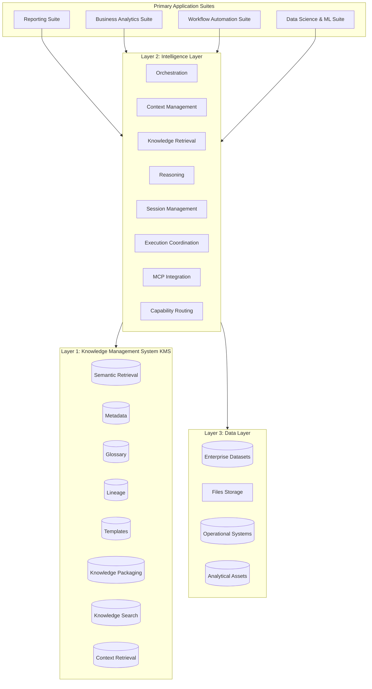
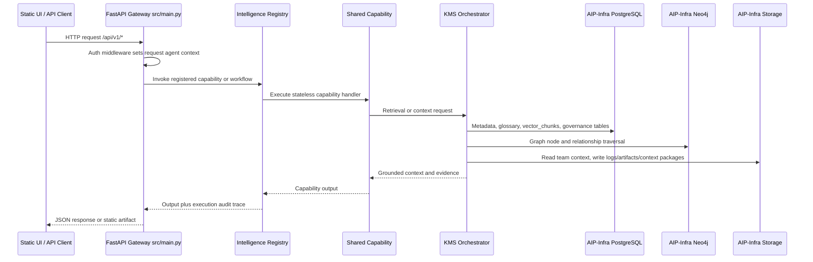

# AIM Intelligence Platform (AIP)

## 📌 Executive Summary

**AIM Intelligence Platform (AIP)** is an enterprise-grade, unified analytics intelligence platform engineered specifically for analytics professionals. AIP acts as the cognitive layer of the modern data stack, bridging the gap between raw data warehouses, structured organizational knowledge, and automated decision workflows. 

AIP is designed to improve analytics productivity, standardize analytical execution, reduce manual effort, improve insight generation quality, and increase institutional knowledge reuse. 

AIP is **NOT** a simple chatbot, a generic BI dashboard, a single workflow application, or a pure retrieval system. It is a highly modular, extensible analytics intelligence platform built upon version-controlled knowledge-grounded execution.

---

## 🏗️ Platform Suites & Products

AIP organizes its user-facing products and workflows into four primary suites:

### 1. Reporting Suite
*Modernize the reporting lifecycle across the enterprise.*
*   **PRISM**: Report inventory intelligence, duplicate report detection, usage analysis, and overlap analysis.
*   **Report Building**: Automated report generation, narrative assistance, standards enforcement, and report quality checks.
*   **Conversational BI**: Natural language analytics, KPI explanation, analytical questioning, and insight retrieval.
*   **Proactive Insights**: Automatic anomaly detection, trend detection, recommendation generation, and proactive monitoring.

### 2. Business Analytics Suite
*Accelerate analytical execution and exploratory insight discovery.*
*   **Insight Discovery**: Automated analytical exploration, trend discovery, and material insight surfacing.
*   **Root Cause Analysis (RCA)**: Driver identification, structural decomposition, and variance contributor analysis.
*   **What-if Analysis**: Dynamic scenario analysis, Monte Carlo simulation, and parameter sensitivity analysis.
*   **Business Narratives**: High-quality executive summaries, data-backed analytical storytelling, and tailored business communication.

### 3. Workflow Automation Suite
*Operationalize analytics execution and automate repeated workflows.*
*   **Workflow Design**: Visual and code-based creation and configuration of analytical execution DAGs.
*   **Workflow Orchestration**: Multi-step task coordination, dynamic variables routing, and execution management.
*   **Task Automation**: Repetitive task scheduling, automated alert processing, and Human-in-the-Loop (HITL) approval routing.
*   **Monitoring**: Real-time pipeline visibility, execution tracking (duration, cost, tokens), and notification dispatches.

### 4. Data Science & ML Suite
*Support model lifecycle activities in a governed, knowledge-integrated environment.*
*   **Data Preparation**: KMS-aligned profiling, transformation, feature engineering, and value validation.
*   **Model Development**: Hyperparameter experimentation, model training pipelines, and statistical evaluation.
*   **Model Documentation**: Metadata logging, automated compliance/governance artifact generation.
*   **Model Pulse**: Periodic validation of predictions against ground truth, feature drift detection, and health monitoring.

---

## 📐 Foundational Layers

AIP's architecture separates execution, reasoning, and semantic knowledge into three modular layers:



### 1. Knowledge Management System (KMS)
Provides the unified institutional knowledge foundation that powers all suites. Grounded in git-managed declarative files representing metrics trees, data lineages, glossaries, and templates.

### 2. Intelligence Layer
Provides the shared platform intelligence, reasoning patterns, cognitive routing, session tracking, and external Model Context Protocol (MCP) integrations.

### 3. Data Layer
Provides secure analytical data access to enterprise datasets, files, operational systems, and analytical assets. Highly secure, internal, and **requires no external third-party integrations**.

---

## How This Solution Works

AIP is split into two repository-level responsibilities:

- **`AIP/`** contains the application runtime: FastAPI gateway, static UI shells, workflow modules, shared intelligence capabilities, KMS orchestration code, and reusable infrastructure clients.
- **`AIP-Infra/`** contains the infrastructure and data surfaces used by the application: Docker Compose services, PostgreSQL/pgvector storage, Neo4j storage, Redis storage, logs, reports, artifacts, archives, and team KMS runtime/context data.

The application must not keep institutional knowledge or demo/reference datasets inside application code. AIP code reads those assets from AIP-Infra through centralized configuration.

### Runtime Flow



### Application Entry Point

The platform starts from:

```bash
cd /Users/chethan/GitHub/AIP-Project/AIP
./start.sh
```

`start.sh`:

1. Creates/activates `.venv` if needed.
2. Installs Python dependencies from `requirements.txt` when core packages are missing.
3. Starts `src.main:app` with Uvicorn on `127.0.0.1:8000` by default.

Useful environment overrides:

```bash
HOST=0.0.0.0 PORT=8000 ./start.sh
AIP_DEV_RELOAD=1 ./start.sh
PYTHON_BIN=/path/to/python3 ./start.sh
```

### Infrastructure

Infrastructure is defined in:

```text
AIP-Infra/docker/docker-compose.yml
```

It provides:

| Service | Purpose | Default Port |
| --- | --- | --- |
| `aip-postgres` | pgvector-capable platform PostgreSQL | `5432` |
| `analytics-source-db` | analytics/LMS PostgreSQL source used by workflows | `5433` |
| `aip-neo4j` | graph database for KMS nodes and relationships | `7474`, `7687` |
| `aip-redis` | Redis cache/session infrastructure | `6379` |

Start and validate infrastructure with:

```bash
cd /Users/chethan/GitHub/AIP-Project/AIP
./check.sh
```

`check.sh` starts Docker Compose, verifies package imports, checks container health, validates Redis/PostgreSQL/Neo4j connectivity, and runs `test_infra.py`.

### Configuration and AIP-Infra Boundaries

All runtime infrastructure and storage paths are centralized in:

```text
AIP/src/shared/config/config.py
```

The `.env` file controls the active endpoints and storage roots:

```env
POSTGRES_HOST=localhost
POSTGRES_PORT=5433
POSTGRES_DB=analyticsdb
POSTGRES_USER=analytics
POSTGRES_PASSWORD=analytics123

REDIS_HOST=localhost
REDIS_PORT=6379

NEO4J_URI=bolt://localhost:7687
NEO4J_USER=neo4j
NEO4J_PASSWORD=password123

AIP_INFRA_ROOT=/Users/chethan/GitHub/AIP-Project/AIP-Infra
STORAGE_ROOT=/Users/chethan/GitHub/AIP-Project/AIP-Infra/storage
REPORT_PATH=/Users/chethan/GitHub/AIP-Project/AIP-Infra/storage/reports
ARTIFACT_PATH=/Users/chethan/GitHub/AIP-Project/AIP-Infra/storage/artifacts
ARCHIVE_PATH=/Users/chethan/GitHub/AIP-Project/AIP-Infra/storage/archives
LOG_PATH=/Users/chethan/GitHub/AIP-Project/AIP-Infra/logs
KMS_ROOT=/Users/chethan/GitHub/AIP-Project/AIP-Infra/kms
KMS_TEAM_ROOT=/Users/chethan/GitHub/AIP-Project/AIP-Infra/kms/<Team>
KMS_TEAM_RUNTIME_PATH=/Users/chethan/GitHub/AIP-Project/AIP-Infra/kms/<Team>/runtime
```

Application code should use `src.shared.config.config` instead of hardcoded filesystem paths.

### How AIP Code Interacts with AIP-Infra

AIP code never talks to Docker volumes or seed files directly from product workflows. The interaction is routed through shared configuration and reusable infrastructure clients:

| AIP code path | AIP-Infra dependency | Interaction |
| --- | --- | --- |
| `AIP/src/shared/config/config.py` | `.env`, `AIP-Infra/storage`, `AIP-Infra/logs` | Loads all hostnames, ports, credentials, and storage paths. Creates expected infra folders when missing. |
| `AIP/src/shared/infra/postgres_client.py` | `analytics-source-db` / PostgreSQL on `POSTGRES_*` | Opens PostgreSQL connections for LMS data, KMS metadata, vector chunks, governance tables, and workflow reads. |
| `AIP/src/shared/infra/neo4j_client.py` | `aip-neo4j` on `NEO4J_URI` | Reads/writes KMS graph nodes and relationships. |
| `AIP/src/shared/infra/redis_client.py` | `aip-redis` on `REDIS_HOST:REDIS_PORT` | Provides Redis connectivity for cache/session-style infrastructure. |
| `AIP/src/shared/infra/storage_client.py` | `AIP-Infra/storage/{reports,artifacts,archives}` and `AIP-Infra/logs` | Writes generated files outside the application tree. |
| `AIP/src/shared/infra/retrieval_client.py` | PostgreSQL + Neo4j through KMS | Keeps retrieval consumers decoupled from physical database details. |
| `AIP/src/kms/index.py` | `AIP-Infra/kms/<Team>/runtime`, PostgreSQL, Neo4j, logs | Creates/updates KMS tables, writes graph data, stages ingested documents, and records audit/ingestion logs.` |
| `AIP/src/main.py` | `REPORT_PATH` and static AIP UI folders | Mounts generated report output from AIP-Infra at `/reports` and serves app UIs/API routes. |

The intended dependency direction is:

```text
Suite workflow -> shared capability -> shared infra client -> AIP-Infra service/storage
```

Code should cross the AIP/AIP-Infra boundary only through `src.shared.config` and `src.shared.infra` clients. Product workflows should depend on capabilities and workflow inputs, not on physical Docker volume paths, physical runtime layouts or database driver details.

Examples:

- A reporting workflow that needs corporate ledger data calls `AnalyticsClient`; it does not read local JSON/SQLite files.
- A knowledge retrieval workflow calls the `knowledge_retrieval` capability; that capability uses `RetrievalClient`, which delegates to KMS, PostgreSQL, and Neo4j.
- A report publishing workflow writes output through configured report/storage paths; generated files are served from AIP-Infra rather than committed into app code.

Do not bypass this route by adding direct file reads from `AIP/src/kms`, local SQLite databases, hardcoded absolute output folders, or embedded knowledge arrays in suite workflows.

### AIP-Infra Runtime Data

KMS runtime/context data lives under team folders in AIP-Infra:

```text
AIP-Infra/kms/
├── Treasury/
│   ├── context/
│   └── runtime/
├── Compliance/
│   ├── context/
│   └── runtime/
├── Credit/
│   ├── context/
│   └── runtime/
└── Model/
    ├── context/
    └── runtime/
```

Important boundary rules:

- Application code must not load seed files.
- Team context is loaded from `AIP-Infra/kms/<Team>/context`.
- Runtime KMS ingestion staging and logs are written to `AIP-Infra/kms/<Team>/runtime`.
- Published reports are written to `REPORT_PATH` and served at `/reports`.
- AIP code should not reintroduce local files such as `src/kms/*.json`, `src/kms/data/*`, local SQLite databases, or seed-driven bootstrap data.

### KMS: Knowledge Grounding

KMS is implemented in:

```text
AIP/src/kms/index.py
```

On first access, KMS:

1. Connects to PostgreSQL through `PostgresClient`.
2. Creates KMS tables such as `vector_chunks`, `canonical_knowledge`, `candidate_knowledge`, `business_terms`, `metrics_glossary`, `analytical_templates`, `knowledge_articles`, audit logs, approvals, connectors, and domains.
3. Stores team-specific KMS context under `AIP-Infra/kms/<Team>/context` and attaches the authenticated team folder to the active Analyst or SME login session.
4. Writes graph nodes and relationships through `Neo4jClient` and PostgreSQL tables.
5. Tokenizes approved or ingested knowledge into `vector_chunks` for retrieval.

Retrieval flow:

1. A request reaches `/api/v1/knowledge/search`, `/api/v1/kms/query`, or `/api/v1/kms/query-advanced`.
2. The `knowledge_retrieval` capability delegates to `RetrievalClient`.
3. `RetrievalClient` calls `advanced_retrieval_orchestration`.
4. KMS searches PostgreSQL vector chunks, enriches matches with Neo4j neighbors, applies RBAC/security filters, detects missing context or contradictions, and returns grounded evidence.

### Analytics Data Source

Analytical data access is implemented through:

```text
AIP/src/shared/infra/analytics_client.py
```

The implementation is PostgreSQL-backed. Product workflows use `AnalyticsClient.get_table_rows(...)` and `AnalyticsClient.run_compatible_read_query(...)` for read-only access. Legacy `?` placeholders are translated to PostgreSQL `%s` placeholders, but no application seed files are loaded.

### Intelligence Layer and Capabilities

The intelligence layer is implemented in:

```text
AIP/src/shared/intelligence.py
AIP/src/shared/capabilities/
```

At startup, `src/main.py` registers shared stateless capabilities:

- `knowledge_retrieval`
- `context_management`
- `summarization`
- `narrative_generation`
- `metric_interpretation`
- `visualization`
- `orchestration`
- `mcp_integration`

The FastAPI middleware maps each request to an agent persona and stores request-scoped context in `active_agent_context`. Capability invocations are logged in memory with masked API keys, agent name, inputs, outputs, duration, and status.

### Product Suites and UIs

Each product suite has a backend workflow module and a static micro-frontend:

```text
AIP/src/reporting/*
AIP/src/business_analytics/*
AIP/src/workflow_automation/*
AIP/src/data_science_ml/*
```

`src/main.py` mounts:

- Master shell at `/`
- KMS UI at `/ui/kms`
- Reporting UIs under `/ui/reporting/*`
- Business analytics UIs under `/ui/business_analytics/*`
- Workflow automation UIs under `/ui/workflow_automation/*`
- Data science/ML UIs under `/ui/data_science_ml/*`
- Published report files under `/reports`

### Authentication Model

API routes under `/api/v1` require a bearer token starting with `AIP-`, except login routes and static UI assets.

Login routes:

- `POST /api/v1/auth/login` for Analyst users.
- `POST /api/v1/auth/sme-login` for SME users.

The default KMS bootstrap users are created in PostgreSQL if missing:

- Analyst: `analyst` / `password`
- SME: `sme` / `password`

### Primary API Groups

| Group | Routes |
| --- | --- |
| Auth | `/api/v1/auth/login`, `/api/v1/auth/sme-login` |
| LMS | `/api/v1/lms/query` |
| KMS search/context | `/api/v1/knowledge/search`, `/api/v1/knowledge/context`, `/api/v1/kms/query`, `/api/v1/kms/query-advanced` |
| KMS governance | `/api/v1/kms/candidates`, `/api/v1/kms/candidates/edit`, `/api/v1/kms/candidates/action`, `/api/v1/kms/canonical`, `/api/v1/kms/approve`, `/api/v1/kms/rollback` |
| KMS operations | `/api/v1/kms/connectors`, `/api/v1/kms/connectors/sync`, `/api/v1/kms/upload`, `/api/v1/kms/observability`, `/api/v1/kms/context-package`, `/api/v1/kms/retriever/download` |
| Capabilities | `/api/v1/capabilities`, `/api/v1/capabilities/invoke` |
| Audit logs | `/api/v1/execution-logs` |
| Reporting | `/api/v1/workflows/reporting/*` |
| Business analytics | `/api/v1/workflows/analytics/*` |
| Workflow automation | `/api/v1/workflows/automation/*` |
| Data science/ML | `/api/v1/workflows/ds/*` |

Example authenticated call:

```bash
curl -H "Authorization: Bearer AIP-DEV-TOKEN" \
  "http://127.0.0.1:8000/api/v1/knowledge/search?q=LCR"
```

### Development Guardrails

- Keep application logic in `AIP/src`.
- Keep infrastructure state, report outputs, artifacts, archives, and logs in `AIP-Infra`.
- Add new reusable platform integrations under `AIP/src/shared/infra`.
- Add new stateless capabilities under `AIP/src/shared/capabilities`.
- Add suite-specific workflows under the relevant suite folder.
- Do not hardcode institutional knowledge, KMS data, LMS data, local database paths, or report output paths inside workflow code.
- Prefer config-driven paths from `src.shared.config.config`.

---

## 📐 Core Architecture & Design Principles

*   **Platform First, Products Second**: Core architectures must be built as shared resources, not custom utilities for a single product.
*   **Modular Architecture**: Clean folder structures, strict importation guidelines, and decoupled modules.
*   **Shared Capabilities Preferred**: Avoid duplicate implementations. Workflows compose shared capabilities, which remain stateless and avoid workflow ownership.
*   **Knowledge-Grounded Execution**: Analytical actions are bound by metrics trees and glossary terms in the KMS, eliminating LLM hallucinations.
*   **Separation of Concerns**: Strict delineation between: `workflows` $\rightarrow$ `capabilities` $\rightarrow$ `knowledge` $\rightarrow$ `intelligence` $\rightarrow$ `data`.
*   **Configuration over Hardcoding**: Drive platform execution dynamically using declarative, version-controlled parameters.

---

## 📅 Platform Build Sequence

The development of AIP is governed by this precise 10-step build sequence:

1.  **Platform Foundation**: Establish shared utilities, connection pools, standard telemetry, and base classes.
2.  **KMS Integration**: Implement semantic metrics compilation, lineage evaluation, and search APIs.
3.  **Intelligence Layer**: Build reasoning engines, session tracking, routing pipelines, and prompt structures.
4.  **Capability Framework**: Implement the 8 core capabilities (`knowledge_retrieval`, `context_management`, etc.).
5.  **Reporting Suite**: Implement stateful workflows for PRISM, Report Builder, Conversational BI, and Proactive Insights.
6.  **Business Analytics Suite**: Implement exploratory canvas, RCA drivers, and simulation pipelines.
7.  **Data Science & ML Suite**: Implement profiling, experiment trackers, and Model Pulse drift monitors.
8.  **Workflow Automation Suite**: Implement workflow builders, execution schedulers, and incident alert systems.
9.  **Hardening**: Implement row-level tenant security, audit logs, and hallucination-preventing validation gates.
10.  **Platformization**: Finalize the unified visual `/ui` shell, auth layers, deployment manifests, and documentation.

---

## 📂 Repository Structure

```text
/Users/chethan/GitHub/AIP-Project/
├── AIP/
│   ├── .env.example                  # Environment template for AIP runtime
│   ├── check.sh                      # Infra and app health check
│   ├── start.sh                      # Local FastAPI launcher
│   ├── requirements.txt              # Python dependencies
│   ├── src/
│   │   ├── main.py                   # FastAPI API gateway and static UI mounts
│   │   ├── shared/
│   │   │   ├── config/config.py      # Central config and AIP-Infra path mappings
│   │   │   ├── infra/                # PostgreSQL, Redis, Neo4j, retrieval, storage clients
│   │   │   ├── capabilities/         # Stateless reusable intelligence capabilities
│   │   │   ├── intelligence.py       # Capability registry, agent context, audit traces
│   │   ├── kms/                      # KMS orchestration and KMS UI only
│   │   ├── reporting/                # Reporting workflows and static UIs
│   │   ├── business_analytics/       # Analytics workflows and static UIs
│   │   ├── workflow_automation/      # Workflow automation modules and static UIs
│   │   ├── data_science_ml/          # DS/ML modules and static UIs
│   │   └── ui/                       # Master platform shell
│   └── test_infra.py                 # Connectivity smoke checks
└── AIP-Infra/
    ├── docker/docker-compose.yml     # PostgreSQL, Neo4j, Redis, analytics PostgreSQL
    ├── logs/                         # Runtime logs
    ├── backups/                      # Backup output root
    ├── retrieval/                    # Retrieval-service infrastructure root
    ├── runtime/                      # Runtime-only generated files
    ├── secrets/                      # Local secret material placeholder; do not commit secrets
    ├── postgres/                     # pgvector PostgreSQL volume
    ├── analytics-data/               # Analytics/LMS PostgreSQL volume
    ├── neo4j/                        # Neo4j volume
    ├── redis/                        # Redis volume
    └── storage/
        ├── reports/                  # Published reports served at /reports
        ├── artifacts/                # Generated artifacts
        └── archives/                 # Archived outputs
```

---

## ✅ Definition of Done (DoD)

A task or pull request is considered fully complete only when:
*   **Code Builds**: Compiles without errors or lint warnings.
*   **Tests Pass**: Verification scripts pass successfully.
*   **Documentation Updated**: READMEs and catalog indices are fully synchronized.
*   **No Duplicate Logic**: Common logic is extracted to shared capabilities.
*   **Architecture Principles Maintained**: Directional import structures are fully respected.
*   **Capabilities Reusable**: Capabilities remain stateless and decoupled.
*   **Platform Modular**: Platform maintains clean encapsulation of worries.

---

💼 *AIM Intelligence Platform (AIP) — Powering the next generation of analytics intelligence.*
